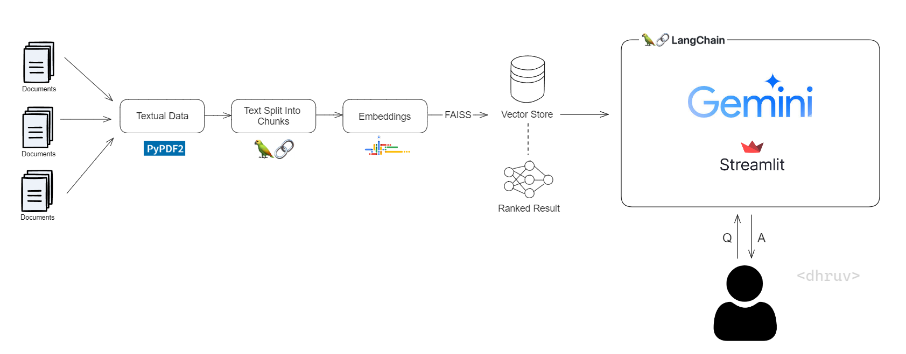

# PDFMATE Gemini 🤖

PDFMATE Gemini is a Streamlit application that facilitates interaction with PDF documents by extracting text and providing responses to user questions. The application utilizes the capabilities of the Google Generative AI model (Gemini) for question answering and utilizes the FAISS library for efficient text embedding similarity search.

## Introduction

The PDFMATE Gemini project offers a user-friendly interface for engaging with PDF documents. Users can upload PDFs, extract text, and inquire about the content, receiving accurate and detailed responses generated by the Gemini AI model.

## Description

The application executes the following core functionalities:

- **PDF Uploading**: Users can upload multiple PDF files via the application interface, enabling seamless access to various documents.
- **Text Extraction**: Text extraction is performed on each page of the uploaded PDFs, ensuring comprehensive access to document content.
- **Text Chunking**: Extracted text is segmented into manageable chunks for streamlined processing, enhancing efficiency in subsequent tasks.
- **Text Embeddings**: Utilizing Google Generative AI Embeddings, embeddings for the text chunks are generated, facilitating semantic understanding and analysis.
- **Similarity Search**: FAISS, a library renowned for its speed in similarity search, is employed to swiftly locate text chunks relevant to user queries.
- **Question Answering**: A conversational AI model powered by Gemini generates responses to user questions based on the content of the uploaded PDFs, enriching the interactive experience.

This project combines natural language processing and machine learning to enable dynamic exploration of PDF documents, fostering intuitive and interactive interactions.

## Libraries & Frameworks

- Google Generative AI (Gemini): For providing powerful capabilities in text understanding and generation.
- FAISS Library: For enabling efficient similarity search of text embeddings.
- Streamlit: For simplifying the development of interactive web applications.
- Langchain: For providing the framework to utilise the Large-Language Model (Gemini here).
